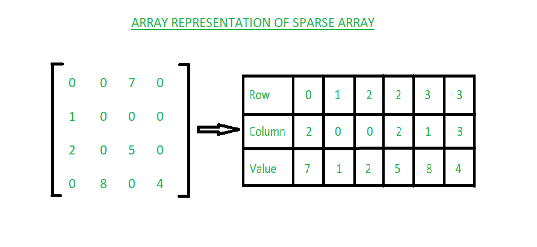

## Array

In C++, an array is a collection of elements of the same type, stored in contiguous memory locations. The size of the array is fixed at the time of declaration and cannot be changed during the program's execution.

Here's a simple example of how to declare and initialize an array in C++:

```cpp
#include <iostream>

int main() {
    // Declare and initialize an array of integers
    int myArray[5] = {1, 2, 3, 4, 5};

    // Access and print the first element of the array
    std::cout << "First element: " << myArray[0] << std::endl;

    return 0;
}
```


In this example, `myArray` is an array of 5 integers. The elements of the array are initialized with the values 1, 2, 3, 4, and 5. The first element of the array (at index 0) is then accessed and printed to the console.

## What happens Array is not initialized?

Why is there a need to initialize an Array?

If the array is not initialized at the time of declaration or any time after that then it will contain some random values in each memory position. These random values can be of two types: 

1. Default values.

1.1 If the array elements are of object types then the default value is null.
    vector<int> array(5); // Creating a vector of size 5 // 0 output

1.2. If the array elements are of primitive data types then the default value is 0.
    int array[5] = {0}; // Initializing an array of size 5 with default values

2. Garbage value:
    int array[5]; // garbage value

3. Default values in Javascript

    let arr = new Array(5); // undefined

## Why does accessing an Array element take O(1) time?
As Arrays are allocated contiguously in memory, Fetching a value via an index of the array is an arithmetic operation. All arithmetic operations are done in constant time i.e., O(1).

Address of ith Index = Base address + offset = Address of 0th Index + i × (size of one element)

## When to use Array over a List?

- If we require fixed length and static allocation then, arrays are used over lists.
- When the faster processing of data is required then arrays are used over lists.
- Primitive data types can be stored in arrays directly but not in lists so, we use arrays over lists.

## Array vs List
ARRAY
1. Arrays are stored in contiguous
location.
2. Fixed in size.
3. Memory is allocated at compile time.
4. Uses less memory than linked lists.
5. Elements can be accessed easily.
6. Insertion and deletion operation takes
time.

LINKED LISTS
1. Linked lists are not stored in
contiguous location.
2. Dynamic in size.
3. Memory is allocated at run time.
4. Uses more memory because it stores
both data and the address of next node.
5. Element accessing requires the
traversal of whole linked list.
6. Insertion and deletion operation is
faster.

## What is meant by Sparse Array?
A sparse array or sparse matrix is an array in which most of the elements are zero.

## Characteristics of Sparse array:
- The sparse array is an array in which most of the elements have the same value(the default value is zero or null).
Sparse matrices are those array that has the majority of their elements equal to zero.
- A sparse array is an array in which elements do not have contiguous indexes starting at zero.
- Sparse arrays are used over arrays when there are lesser non-zero elements. Sparse arrays require lesser memory to store the elements and the computation time can be saved. 

## Why sparse array is required over simple arrays to store the elements:

1. Storage: When there is the maximum number of zero elements and the minimum number of non-zero elements then we use a sparse array over a simple array as it requires less memory to store the elements. In the sparse array, we only store the non-zero elements. 

2. Computation Time: In the sparse array we only store non-zero elements and hence, traversing only non-zero elements takes less computation time.
Representation of Sparse Array:
Sparse arrays can be represented in two ways:

## Array Representation


1. Array Representation:

To represent a sparse array 2-D array is used with three rows namely: Row, Column, and Value.

Row: Index of the row where non-zero elements are present.
Column: Index of the column where the non-zero element is present.
Value: The non-zero value which is present in (Row, Column) index.




2. Linked List Representation:

To represent a sparse array using linked lists, each node has four fields namely: Row, Column, Value, and Next node.

Row: Index of the row where non-zero elements are present.
Column: Index of the column where the non-zero element is present.
Value: The non-zero value which is present in (Row, Column) index.
Next node: It stores the address of the next node.


## Benefits of Heap over Sorted arrays:

- Heap takes less time complexity as compared to the sorted arrays in terms of creation. Building heap takes O(n) time complexity, whereas building Sorted Array takes O(n.log n) time. 
- Insertion and deletion in the heaps are efficient heaps as compared to sorted arrays. When small numbers of elements are removed or added, with the requirement to print the smallest element after each change, Heap outperforms sorted arrays.
- Multiple heaps can be formed using the same n elements while in sorted arrays, they can be arranged in either ascending or descending order. 
- Time Complexity for Heap and Sorted Array over different operations can be seen using below table:
Data structure 	Insert  	Search 	    Find min 	Delete min
Sorted array	O(n)	    O(log n)	O(1)	    O(n)
Min heap	    O(log n)	O(n)	    O(1)	    O(log n)

## Why cannot we declare an array with a negative size?

As per the convention of array declaration, it is mandatory that each time an array is evaluated it shall have a size greater than 0. Declaring array size negative breaks this “shall” condition. That’s why this action gives an error.

## Why cannot we use Array.length() in Java?

Though arrays are objects in Java but length is an instance variable (data item) in the array object and not a method. So, we cannot use the length() method to know the array length.

        int arr[] = new int[3];
        int size = arr.length(); // error

        int[] arr = new int[3];

        // length is a field variable for array arr
        System.out.println("Length of the array is: " + arr.length); // gives length
 
        String str = "GeeksFor";

        // length() is method for
        // getting length of string
        System.out.println("Length of the string " + str + " is: " + str.length()); // gives length

## Why is it faster to process sorted array than an unsorted array ?
- Time taken for processing a sorted array is less as compared to unsorted array. The reason for this optimisation for sorted array is branch prediction. 

## What is branch prediction ?
In computer architecture, branch prediction means determining whether a conditional branch(jump) in the instruction flow of a program is likely to be taken or not. All the pipelined processors do branch prediction in some form, because they must guess the address of the next instruction to fetch before the current instruction has been executed. 

## How does C allocate memory of data items in a multidimensional array?
- The data items in a multidimensional array are stored in the form of rows and columns. Also, the memory allocated for the multidimensional array is contiguous. So the elements in multidimensional arrays can be stored in linear storage using two methods i.e., row-major order or column-major order.

- C compilers use Row major order method to store the elements in the memory. Basically, C compilers stores multidimensional arrays as single dimension arrays whose elements are single-dimensional arrays or a multidimensional array whose dimension is 1 less than the former. And the storage of these array objects is row-wise. 

## How to pass and return a 3-Dimensional Array in C++?
In C++ a 3-dimensional array can be implemented in two ways:

1. Using array (static)
2. Using vector (dynamic)

## Passing a static 3D array in a function: Using pointers while passing the array. Converting it to the equivalent pointer type.

```
char ch[2][2][2];
void display(char (*ch)[2][2]) {
    . . .
}
```

// C++ code to demonstrate the above method

#include <bits/stdc++.h>
using namespace std;

// Function to show how to pass a 3D character array to a function
void display(char (*ch)[2][2])
{
	for (int i = 0; i < 2; i++) {
		for (int j = 0; j < 2; j++) {
			for (int k = 0; k < 2; k++) {
				cout << "ch[" << i << "][" << j << "]["
					<< k << "] = " << ch[i][j][k] << endl;
			}
		}
	}
}

// Driver code
int main()
{
	char ch[2][2][2] = { { { 'a', 'b' }, { 'c', 'd' } },
						{ { 'e', 'f' }, { 'g', 'h' } } };

	// Function call with 3D array as parameter
	display(ch);
	return 0;
}

Time Complexity:   O(n3)

Auxiliary Space: O(1)

## Passing 3D vector (dynamic array): When a vector is passed to a function, it can either be passed by value, where a copy of the vector is stored, or by reference, where the address of the vector is passed.

Pass by value: 
void function(vector <vector <vector < char >>> ch) {
    . . .
}

Pass by reference (Better):
void function(vector< vector < vector < char>>> &ch) {
    . . .
}

// C++ code to demonstrate the initialization
// and passing as a parameter (passed as reference)

#include <bits/stdc++.h>
using namespace std;

// Parameter passed as reference
void display(vector<vector<vector<char> > >& ch)
{
	for (int i = 0; i < 2; i++) {
		for (int j = 0; j < 2; j++) {
			for (int k = 0; k < 2; k++) {
				cout << "ch[" << i << "][" << j << "]["
					<< k << "] = " << ch[i][j][k] << endl;
			}
		}
	}
}

int main()
{
	vector<vector<vector<char> > > ch
		= { { { 'a', 'b' }, { 'c', 'd' } },
			{ { 'e', 'f' }, { 'g', 'h' } } };

	// Function to call function by passing as parameter
	display(ch);
	return 0;
}
Time Complexity:  O(n3)

Auxiliary Space: O(1)

## Returning a 3D array: A static array cannot be returned from a function in C++. So we have to pass a 3D vector from a function to get the functionality of returning a 3D array.

vector <vector< vector <char>>> fun() {
    vector <vector< vector <char>>> ch;
    . . .
    return ch;
}

## Anonymous Array in Java
An array in Java without any name is known as an anonymous array. It is an array just for creating and using instantly. Using an anonymous array, we can pass an array with user values without the referenced variable.

## Properties of Anonymous Arrays:

- We can create an array without a name. Such types of nameless arrays are called anonymous arrays.
- The main purpose of an anonymous array is just for instant use (just for one-time usage).
- An anonymous array is passed as an argument of a method.

Note: For Anonymous array creation, do not mention size in []. The number of values passing inside {} will become the size.

Syntax: 

new <data type>[]{<list of values with comma separator>};

Examples:

// anonymous int array 
new int[] { 1, 2, 3, 4};  

// anonymous char array 
new char[] {'x', 'y', 'z'}; 

// anonymous String array
new String[] {"Geeks", "for", "Geeks"}; 

// anonymous multidimensional array
new int[][] { {10, 20}, {30, 40, 50} };

## Java program to illustrate the concept of anonymous array

class Test {
	public static void main(String[] args)
	{
		// anonymous array
		sum(new int[]{ 1, 2, 3 });
	}

	public static void sum(int[] a)
	{
		int total = 0;

		// using for-each loop
		for (int i : a) 
			total = total + i;
		
		System.out.println("The sum is: " + total);
	}
}

# Default Array Values in Java
If we don’t assign values to array elements and try to access them, the compiler does not produce an error as in the case of simple variables. Instead, it assigns values that aren’t garbage. 

Below are the default assigned values. 

S. No.	Datatype	        Default Value
1	    boolean	            false
2	    int	                0
3	    double	            0.0
4	    String	            null
5	    User-Defined Type	null

## reverse an array

1. use loop and insert array in new array from backwards and print it. TC-O(N) SC-O(N)

2. inplace reversal. TC-O(N) SC-O(1)
    while(start<end){
        swap(start, end)
    }

3. use inbuilt reverse function. TC-O(N) SC-O(N) because Additional space is used to store the reversed array.

4. use stack to reverse array. TC-O(N) SC-O(N)

